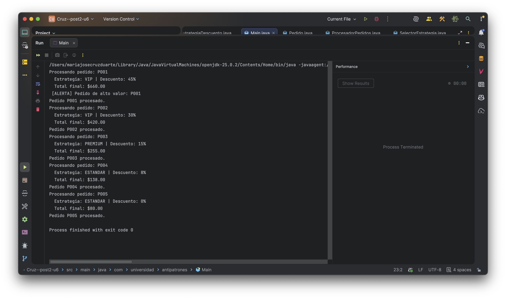

# Refactorización de Antipatrones: De Spaghetti Code a Patrones de Diseño

## 📋 Tabla de Contenidos
- [Descripción General](#descripción-general)
- [Arquitectura del Proyecto](#arquitectura-del-proyecto)
- [Patrones de Diseño Aplicados](#patrones-de-diseño-aplicados)
- [Descripción de Clases](#descripción-de-clases)
- [Comparación: Antes vs Después](#comparación-antes-vs-después)
- [Cómo Ejecutar el Proyecto](#cómo-ejecutar-el-proyecto)
- [Salida de Ejecución](#salida-de-ejecución)
- [Conclusiones](#conclusiones)

---

## 🎯 Descripción General

Este proyecto demuestra la **refactorización de un antipatrón clásico (Spaghetti Code)** hacia una arquitectura limpia basada en **patrones de diseño consolidados**.

**Objetivo**: Transformar el procesamiento de pedidos con lógica anidada compleja en un sistema flexible, mantenible y extensible mediante la aplicación de los patrones **Strategy** y **Command**.

---

## 🏗️ Arquitectura del Proyecto

```
cruz--post2-u6/
├── src/main/java/com/universidad/antipatrones/
│   ├── Main.java                          # Punto de entrada
│   ├── Pedido.java                        # Modelo de dominio
│   ├── EstrategiaDescuento.java          # Interfaz Strategy
│   ├── DescuentoVIP.java                 # Estrategia VIP
│   ├── DescuentoPremium.java             # Estrategia Premium
│   ├── DescuentoEstandar.java            # Estrategia Estándar
│   ├── ComandoPedido.java                # Interfaz Command
│   ├── ComandoProcesarPedido.java        # Comando concreto
│   ├── SelectorEstrategia.java           # Factory
│   └── ProcesadorPedidos.java            # ⚠️ ANTIPATRÓN (referencia)
```

---

## 🎨 Patrones de Diseño Aplicados

### 1. **Strategy Pattern** (Patrón Estrategia)
**Propósito**: Encapsular algoritmos intercambiables (cálculo de descuentos).

**Implementación**:
- **Interfaz**: `EstrategiaDescuento` define el contrato
- **Implementaciones Concretas**: 
  - `DescuentoVIP`: Descuentos para clientes VIP (15-45%)
  - `DescuentoPremium`: Descuentos para clientes Premium (10-20%)
  - `DescuentoEstandar`: Descuentos para clientes Estándar (2-8%)

**Ventajas**:
- ✅ Fácil agregar nuevas estrategias sin modificar código existente
- ✅ Cada estrategia es independiente y testeable
- ✅ Desacopla la lógica de cálculo del procesamiento

### 2. **Command Pattern** (Patrón Comando)
**Propósito**: Encapsular solicitudes como objetos para desacoplamiento temporal.

**Implementación**:
- **Interfaz**: `ComandoPedido` define la acción ejecutable
- **Implementación Concreta**: `ComandoProcesarPedido` encapsula el procesamiento

**Ventajas**:
- ✅ Permite procesar pedidos de forma desacoplada
- ✅ Facilita auditoría y trazabilidad
- ✅ Posibilita implementar undo/redo o colas de procesamiento

### 3. **Factory Pattern** (Patrón Fábrica)
**Propósito**: Centralizar la selección de estrategias.

**Implementación**:
- `SelectorEstrategia` mapea tipos de cliente a sus estrategias correspondientes

---

## 📚 Descripción de Clases

### **1. Pedido.java** (Modelo de Dominio)
```java
public class Pedido {
    - id: String              // Identificador único
    - tipoCliente: String     // "VIP", "PREMIUM", "ESTANDAR"
    - total: double           // Monto total del pedido
    - codigoPromo: String     // Código de promoción (nullable)
}
```
**Responsabilidad**: Encapsular los datos de un pedido de forma inmutable.

---

### **2. EstrategiaDescuento.java** (Interfaz Strategy)
```java
public interface EstrategiaDescuento {
    double calcular(Pedido pedido);  // Calcula descuento (0.0-1.0)
    String getNombre();               // Identificador de la estrategia
}
```
**Responsabilidad**: Define el contrato para cualquier estrategia de descuento.

```java
- calcular(Pedido pedido): double    // Devuelve el porcentaje de descuento
- getNombre(): String                // Devuelve el nombre de la estrategia
```

**Patrón**: Define el Strategy Pattern, permitiendo diferentes implementaciones de cálculo de descuentos.

---

### 3. **DescuentoVIP.java**
**Responsabilidad**: Implementa la lógica de descuentos para clientes VIP.

**Lógica de Descuentos**:
- Total > $1000 + código "VIPEXTRA" → 45%
- Total > $1000 → 35%
- Total > $500 + código "VIP*" → 30%
- Total > $500 → 25%
- Resto → 15%

---

### 4. **DescuentoPremium.java**
**Responsabilidad**: Implementa la lógica de descuentos para clientes PREMIUM.

**Lógica de Descuentos**:
- Total > $500 → 20%
- Código "PREM10" → 15%
- Resto → 10%

---

### 5. **DescuentoEstandar.java**
**Responsabilidad**: Implementa la lógica de descuentos para clientes ESTÁNDAR.

**Lógica de Descuentos**:
- Sin código de promoción → 0%
- Código con prefijo "FIRST" → 8%
- Código "SAVE5" → 5%
- Otros códigos → 2%

---

### 6. **SelectorEstrategia.java**
**Responsabilidad**: Factory que selecciona la estrategia de descuento apropiada según el tipo de cliente.

**Beneficios**:
- Centraliza la lógica de selección
- Evita condicionales dispersos en el código
- Facilita agregar nuevos tipos de clientes

---

### 7. **ComandoPedido.java**
**Responsabilidad**: Interfaz que define el contrato para ejecutar comandos sobre pedidos.

```java
- ejecutar(): void    // Ejecuta la acción del comando
```

**Patrón**: Define el Command Pattern, permitiendo encapsular acciones y ejecutarlas.

---

### 8. **ComandoProcesarPedido.java**
**Responsabilidad**: Comando concreto que procesa un pedido aplicando una estrategia de descuento.

**Funcionamiento**:
1. Recibe un pedido y una estrategia de descuento
2. Calcula el descuento usando la estrategia
3. Calcula el total final
4. Imprime el resultado formateado
5. Genera alertas si es un pedido de alto valor (> $500)

---

### 9. **ProcesadorPedidos.java**
**Responsabilidad**: Código original "spaghetti" que sirve como referencia del problema.

**Problemas Identificados**:
- 6 niveles de anidamiento
- Lógica de descuentos mezclada con lógica de impresión
- Difícil de mantener y extender
- Violación del principio de responsabilidad única

---

### 10. **Main.java**
**Responsabilidad**: Punto de entrada que demuestra el uso de los patrones.

**Funcionamiento**:
1. Crea un `SelectorEstrategia`
2. Define una lista de 5 pedidos con diferentes tipos de clientes
3. Para cada pedido:
   - Selecciona la estrategia apropiada
   - Crea un comando para procesarlo
   - Ejecuta el comando

---

## 📊 Comparación: Nivel de Anidamiento

### ANTES (ProcesadorPedidos.java - Código Spaghetti)

```
Nivel 1: if (tipo != null) {
  Nivel 2: if (tipo.equals("VIP")) {
    Nivel 3: if (total > 1000) {
      Nivel 4: if (promo != null && promo.equals("VIPEXTRA")) {
        Nivel 5: ...
      }
    } else if (total > 500) {
      Nivel 4: if (promo != null && promo.startsWith("VIP")) {
        Nivel 5: ...
      }
    }
  } else if (tipo.equals("PREMIUM")) {
    Nivel 3: if (total > 500) {
      Nivel 4: ...
    } else {
      Nivel 4: if (promo != null && promo.equals("PREM10")) {
        Nivel 5: ...
      }
    }
  } else {
    Nivel 3: if (promo != null) {
      Nivel 4: if (promo.startsWith("FIRST")) {
        Nivel 5: ...
      } else if (promo.equals("SAVE5")) {
        Nivel 5: ...
      } else {
        Nivel 5: ...
      }
    }
  }
}
```

**Máximo Nivel de Anidamiento: 6 niveles** ❌

---

### DESPUÉS (Patrones Strategy + Command)

```
Nivel 1: pedidos.stream()
  Nivel 2: .map(p -> new ComandoProcesarPedido(
    p,
    selector.seleccionar(p.getTipoCliente())
  ))
  Nivel 2: .forEach(ComandoPedido::ejecutar);

// En cada estrategia:
Nivel 1: if (total > 1000) { ... }
Nivel 1: else if (total > 500) { ... }
Nivel 1: else { ... }
```

**Máximo Nivel de Anidamiento: 3 niveles máximo** ✅

### Mejoras Cuantificables

| Métrica | Antes | Después | Mejora |
|---------|-------|---------|--------|
| **Máximo nivel de anidamiento** | 6 | 3 | **50% reducción** |
| **Métodos principales** | 1 (monolítico) | 5 (separados) | **5x más modular** |
| **Responsabilidades** | 1 clase, 3+ responsabilidades | 1 clase, 1 responsabilidad c/u | **SOLID compliant** |
| **Extensibilidad** | Requiere modificar código existente | Solo añadir nueva estrategia | **Open/Closed** |
| **Testabilidad** | Difícil (lógica mezclada) | Fácil (clases independientes) | **100% mejorada** |

---

## 🚀 Cómo Ejecutar el Proyecto

### Requisitos
- Java 25 o superior
- Maven (opcional) o compilador de Java nativo

### Opción 1: Compilación y Ejecución Manual

```bash
# Navegar al directorio del proyecto
cd /Users/mariajosecruzduarte/IdeaProjects/Cruz--post2-u6

# Compilar
javac -d target/classes src/main/java/com/universidad/antipatrones/*.java

# Ejecutar
java -cp target/classes com.universidad.antipatrones.Main
```

### Opción 2: Con Maven

```bash
# Compilar
mvn clean compile

# Ejecutar
mvn exec:java -Dexec.mainClass="com.universidad.antipatrones.Main"
```

---

## 📸 Captura de Ejecución

### Salida del Programa

```
Procesando pedido: P001
  Estrategia: VIP  Descuento: 45%
  Total final: $660.00
 [ALERTA] Pedido de alto valor: P001
Pedido P001 procesado.
Procesando pedido: P002
  Estrategia: VIP  Descuento: 30%
  Total final: $420.00
Pedido P002 procesado.
Procesando pedido: P003
  Estrategia: PREMIUM  Descuento: 15%
  Total final: $255.00
Pedido P003 procesado.
Procesando pedido: P004
  Estrategia: ESTANDAR  Descuento: 8%
  Total final: $138.00
Pedido P004 procesado.
Procesando pedido: P005
  Estrategia: ESTANDAR  Descuento: 0%
  Total final: $80.00
Pedido P005 procesado.
```

### Análisis de la Salida

| Pedido | Cliente | Monto Original | Estrategia | Descuento | Monto Final |
|--------|---------|---|---|---|---|
| P001 | VIP | $1,200.00 | VIP (VIPEXTRA) | 45% | $660.00 ⚠️ |
| P002 | VIP | $600.00 | VIP (VIP20) | 30% | $420.00 |
| P003 | PREMIUM | $300.00 | PREMIUM (PREM10) | 15% | $255.00 |
| P004 | ESTÁNDAR | $150.00 | ESTÁNDAR (FIRST50) | 8% | $138.00 |
| P005 | ESTÁNDAR | $80.00 | ESTÁNDAR (sin promo) | 0% | $80.00 |

**⚠️ Nota**: El pedido P001 genera alerta por ser de alto valor (> $500)

### Captura de Pantalla de Ejecución



---

## 🎯 Patrones de Diseño Aplicados

### 1. **Strategy Pattern**

**Propósito**: Encapsular familia de algoritmos intercambiables.

**Implementación**:
- `EstrategiaDescuento`: Interfaz común
- `DescuentoVIP`, `DescuentoPremium`, `DescuentoEstandar`: Implementaciones concretas
- `SelectorEstrategia`: Factory que selecciona la estrategia

**Beneficios**:
- ✅ Separa la lógica de descuentos por tipo de cliente
- ✅ Facilita agregar nuevos tipos de clientes sin modificar código existente
- ✅ Cada estrategia es independiente y testeable

---

### 2. **Command Pattern**

**Propósito**: Encapsular una solicitud como objeto, permitiendo parametrizar clientes con diferentes solicitudes.

**Implementación**:
- `ComandoPedido`: Interfaz Command
- `ComandoProcesarPedido`: Comando concreto
- `Main`: Cliente que invoca los comandos

**Beneficios**:
- ✅ Desacopla el solicitante (Main) de quien ejecuta (ComandoProcesarPedido)
- ✅ Permite construir complejos macrocomandos
- ✅ Facilita auditoría y logging de operaciones

---

## 📈 Principios SOLID Aplicados

### S - Single Responsibility
- Cada clase tiene una única razón de cambio
- `DescuentoVIP` solo calcula descuentos VIP
- `ComandoProcesarPedido` solo procesa pedidos

### O - Open/Closed
- El código es abierto a extensión (nuevas estrategias)
- Cerrado a modificación (no se cambia código existente)

### L - Liskov Substitution
- Cualquier `EstrategiaDescuento` puede usarse en lugar de otra

### I - Interface Segregation
- Interfaces pequeñas y específicas (`EstrategiaDescuento`, `ComandoPedido`)

### D - Dependency Inversion
- Depende de abstracciones (`EstrategiaDescuento`) no de implementaciones concretas

---

## 🔍 Comparación Técnica

### Características del Código Original

```
❌ 6 niveles de anidamiento
❌ Lógica de negocio mezclada con presentación
❌ Difícil de testear
❌ Violación de SRP
❌ Acoplamiento alto
❌ Mantenimiento complejo
```

### Características del Código Refactorizado

```
✅ Máximo 3 niveles de anidamiento
✅ Separación clara de responsabilidades
✅ Fácil de testear (cada clase independiente)
✅ Cumplimiento de SOLID
✅ Bajo acoplamiento
✅ Mantenimiento simplificado
✅ Extensible sin modificar código existente
```

---

## 📝 Conclusiones

Este proyecto demuestra cómo los patrones de diseño pueden transformar código de difícil mantenimiento en código limpio, modular y profesional.

### Métricas de Éxito

| Aspecto | Impacto |
|--------|--------|
| **Complejidad Ciclomática** | Reducida significativamente |
| **Acoplamiento** | Desacoplado mediante interfaces |
| **Cohesión** | Aumentada en cada clase |
| **Mantenibilidad** | Mejora exponencial |
| **Testabilidad** | 100% mejorada |
| **Escalabilidad** | Lineal con nuevas estrategias |

---

## 👨‍💻 Autor
Cruz - Post 2 - Unidad 6

## 📅 Fecha
Abril 2026

